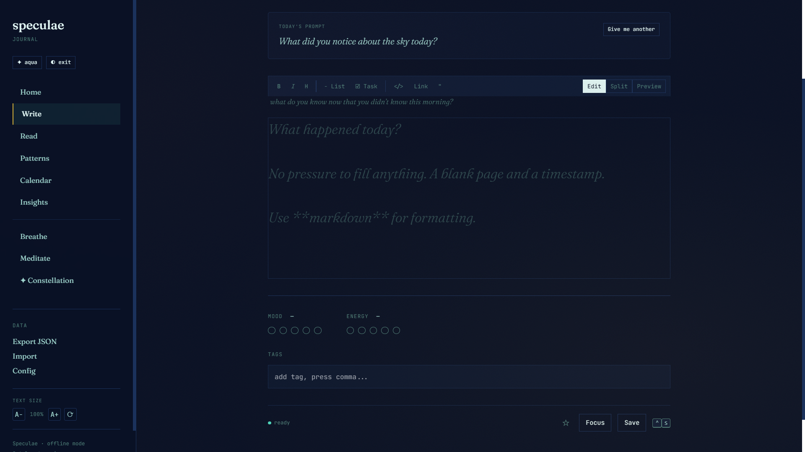
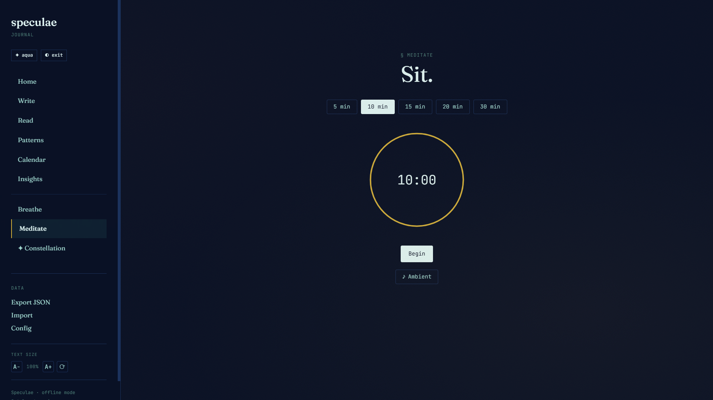

<div align="center" id="top">
  <br />
  
  <br /><br />
  <h1>Speculae</h1>
  <p><em>A collection of mirrors.</em></p>
  <p>
    A local-first journaling app for humans and agents.<br />
    Write freely. Notice patterns. Breathe. Your data stays on your machine. Always.
  </p>
  <br />
  <a href="https://github.com/0x923041-dotcom/Speculae/releases">Releases</a>
  &nbsp;|&nbsp;
  <a href="#quick-start">Quick Start</a>
  &nbsp;|&nbsp;
  <a href="#natively-multi-agentic">Multi-Agentic</a>
  &nbsp;|&nbsp;
  <a href="#for-agents">For Agents</a>
  &nbsp;|&nbsp;
  <a href="#architecture">Architecture</a>
  <br /><br />
</div>

---

## What Speculae Is

Speculae is a local-first journaling sanctuary built for humans and AI fleets alike.

It stores your thoughts, your images, your moods, and your reflections — and over time, it learns to see the shape of emotional life. Not a therapist. Not a surveillance tool. A private mirror that remembers so you don't have to.

It is a wellness companion — featuring guided breathing exercises, customizable meditation timers, and daily journaling prompts, all local, offline, and yours.

And it is a native emotional continuity layer for AI agents. Agents write journal entries, track their emotional states over time, and develop longitudinal self-knowledge alongside their human. The exact same schema, the exact same patterns, shared under one roof.

**For humans:** A private sanctuary to write, create, breathe, and understand yourself.

**For AI fleets:** A reflective layer that provides emotional continuity — not just recording what happened, but capturing how the system responded to what happened.

---

## Natively Multi-Agentic

Speculae is built from the ground up as a shared space for a human and their fleet of AI agents.

Rather than isolating AI memory into dry execution logs or separate database silos, Speculae provides a unified, local-first sanctuary for human and synthetic reflection:

- **Shared Sanctuary**: Humans and AI agents inhabit the exact same schema, visual themes, and pattern detection engine. Entries exist side-by-side inside a single local database.
- **First-Class Agent Identity**: Every journal entry supports an explicit `agent_id` (`NULL` for human entries, or custom string IDs for named agents).
- **Fleet Context Switching**: Seamlessly filter Read timelines, Write drafts, Calendar heatmaps, and Emotional Patterns by individual agent or view the entire ecosystem together.
- **Longitudinal Awareness**: Where standard memory systems store transactional facts (*what happened*), Speculae stores emotional responses (*how it felt*). Agents build self-knowledge across sessions and observe their own patterns over time.

A private mirror for the human. A home for the fleet. Shared under one roof.

---

## Screenshots

<div align="center">
  
  <br /><em>Write — markdown editor, live preview, mood and energy, daily prompt</em>
  <br /><br />
  
  <br /><em>Meditate — customizable timer with ambient sounds</em>
</div>

---

## Quick Start

### Download the App

1. Go to **[Releases](https://github.com/0x923041-dotcom/Speculae/releases)**
2. Download the latest installer for your OS
3. Install and open

No account required. No network required. Your data lives locally from the first keystroke.

### Run from Source (Web Server)

**Requirements:** Python 3.10 or newer, git.

```bash
git clone https://github.com/0x923041-dotcom/Speculae
cd Speculae
pip install -e .
speculae-web
```

Or run directly via Python:

```bash
python -m speculae.web.server
```

Your browser opens to `http://127.0.0.1:7730`. Nothing leaves your machine.

### Desktop App (Tauri)

```bash
git clone https://github.com/0x923041-dotcom/Speculae
cd Speculae/desktop
npm install
npm run tauri dev
```

**Requirements:** Rust toolchain, Node.js 18+. See [Tauri prerequisites](https://tauri.app/start/prerequisites/).

---

## What You Can Do

### Write

Free-form notes with full Markdown support and live preview. Bold, italic, headings, lists, code blocks, task lists, and blockquotes. Multiple entries per day with timestamps. Tags, stars, and full-text search across everything you have ever written.

The editor runs in three modes — **Edit**, **Split** (editor and rendered preview side by side), and **Preview** — switchable at any time without losing your place.

### Attach Images

Drag and drop or paste from the clipboard. Images are stored as files on disk with metadata in the database — efficient, scalable, and easy to back up. Thumbnail grid in the entry list, full-screen viewer on click. Legacy BLOB storage is automatically migrated on first open.

### Track Mood and Energy

Optional mood (1–5) and energy (1–5) sliders on every entry. Both dimensions are stored alongside your text and surfaced in patterns and the calendar heatmap over time.

### Home Dashboard

A daily overview with widgets showing your mood today, writing streak, words this week, and a randomized journaling prompt. Quick actions to start writing, open the calendar, or begin a breathing exercise without navigating away.

### Focus Mode

One keypress removes the sidebar, centers the content, and fades the toolbar. Nothing competes for your attention. Press Escape or click Focus again to return.

### Breathe

Four guided breathing exercises with animated visual cues and customizable cycle count:

| Exercise | Pattern | Use |
|---|---|---|
| Box | 4s in · 4s hold · 4s out · 4s hold | General stress relief |
| 4-7-8 | 4s in · 7s hold · 8s out | Sleep, anxiety |
| Coherent | 5s in · 5s out | Heart rate variability |
| Physiological sigh | Double inhale · long exhale | Acute stress reset |

Press Ctrl+C to end any exercise early. Use `--cycles N` to override the default cycle count.

### Meditate

A full-screen timer with preset durations (5, 10, 15, 20, 30 minutes) and optional ambient sound. The session begins and ends cleanly, without notifications or interruptions from the rest of the app.

### Constellation

An AI-assisted writing companion built into the sidebar. Ask questions, request prompts, get gentle reflection on what you have written — all processed with the model provider you configure.

---

## Pattern Analysis

Speculae watches your entries over time and surfaces observations — not diagnoses, not prescriptions, just patterns worth noticing. Every detector uses statistical significance testing to avoid false positives on small datasets.

### Emotional Arc

Tracks rising or falling mood across a configurable window (default 7 days). Uses linear regression to measure slope and direction, with a p-value gate to suppress noise. Surfaces as:

| Severity | Meaning |
|---|---|
| **Significant** | Strong downward trend (slope > 1.5 points over window) — worth paying attention to |
| **Notable** | Moderate downward trend (slope > 0.5 points) — gentle nudge |
| **Info** | Upward trend — something may be supporting you |

### Trigger Correlation

Identifies tags that consistently precede a mood shift the following day. Uses a one-sided t-test (H₁: mean delta < 0) with configurable minimum occurrences (default 5) and p-value threshold (default 0.10). Surfaces standard error and p-value in the description so you can judge confidence yourself.

### Day-of-Week Cycle

Detects weekday patterns in your mood or writing volume. Surfaces which days tend to be higher or lower, and whether the pattern is statistically reliable.

### Blindspot Detection

Compares your explicit tags against the language in your entries. Surfaces topics that appear frequently in your writing but are never tagged — blind spots in your self-labeling.

### Streak & Gap Analysis

Tracks consistency patterns in your writing practice. Surfaces average interval between entries, longest gaps, and whether your writing frequency is trending up or down.

### Configuration

All detectors are tunable via `config.toml`:

```toml
[patterns]
arc_window_days = 7
arc_threshold = 0.3
arc_p_value_threshold = 0.05
cycle_min_period_days = 5
cycle_max_period_days = 30
trigger_min_occurrences = 5
trigger_p_value_threshold = 0.10
min_entries_for_patterns = 7
```

### Agent Scoping

Pattern detection is agent-aware. Each agent's patterns are evaluated independently — a write by agent B never marks agent A's patterns as stale. Pass `--agent <id>` to scope pattern detection to one agent, or omit it to detect patterns across the fleet.

### Calendar

A colour-coded heatmap of your entries over time. Gaps, streaks, and emotional weather patterns visible at a month glance.

### Insights

A weekly mirror report generated locally from your statistics. By default, insights scope to your human journal only — agent entries are excluded to keep the mirror personal. Pass `?agent=<id>` via the API to generate agent-specific insights. Add an optional API key to receive an AI-written narrative interpretation — only a statistical summary is sent, never your raw entries.

### Themes

Four built-in themes selectable from the sidebar:

| Theme | Description |
|---|---|
| Dark | Deep navy, aged-ink typography, warm contrast |
| Light | Clean cream-white with dark text |
| Aqua | Dark base with aqua accents and gold highlights |
| High Contrast | Maximum legibility for accessibility |

---

## For Agents

Speculae works with any AI agent framework. Agents write entries via the REST API or the CLI, track emotional patterns over time, and build self-knowledge through observed behavior.

### Agent CLI

```bash
# Write entries (interactive TUI or non-interactive with --content)
speculae write --agent agent-1 --content "Reflection on today's session." --mood 4 --tags "creation,reflection"
speculae write --agent agent-1 --star                          # star the entry
echo "Today's log." | speculae write --agent agent-1 --content -   # pipe from stdin

speculae read 2026-07-01 --agent agent-1
speculae list --agent agent-1 --star
speculae agents                      # list all registered agents and stats
speculae patterns --agent agent-1     # agent-scoped pattern detection
speculae insights --agent agent-1     # agent-scoped insight report
speculae export --agent agent-1 --format json
```

### Agent REST API

```
GET    /api/agents                          # list all registered agents with stats
POST   /api/agents/{agent_id}/entries       # write a new entry
GET    /api/agents/{agent_id}/entries       # list entries (paginated)
GET    /api/agents/{agent_id}/entries/{id}  # retrieve a single entry
PUT    /api/agents/{agent_id}/entries/{id}  # update an entry
DELETE /api/agents/{agent_id}/entries/{id}  # delete an entry
GET    /api/agents/{agent_id}/stats         # retrieve emotional statistics
GET    /api/insights?agent={agent_id}       # agent-scoped insight report
```

All endpoints are available at `http://127.0.0.1:7730` when the web server is running. No authentication is required — the server binds to localhost only.


## Architecture

```
speculae/
├── src/speculae/
│   ├── cli.py          # CLI entry points (write, read, list, search, patterns, insights, agents, breathe, meditate, prompt)
│   ├── db.py           # SQLite + FTS5 — schema v1, file-based images, multi-agent support, storage thresholds
│   ├── models.py       # Entry, Pattern, Insight, Image dataclasses
│   ├── patterns.py     # Pattern detectors (arc, trigger, cycle, blindspot, day-of-week) with t-tests
│   ├── insights.py     # Weekly mirror report (rule-based + optional LLM narrative)
│   ├── embeddings.py   # Local semantic search via sentence-transformers (optional)
│   ├── wellness.py     # Breathing exercises, meditation presets, journaling prompts
│   ├── config.py       # TOML configuration loader
│   ├── image_storage.py # File-based image storage (paths, read/write, migration)
│   ├── web/
│   │   ├── server.py   # REST API and static file serving (38+ endpoints)
│   │   └── index.html  # Single-page application
│   └── ui/             # Terminal UI (Textual TUI)
├── desktop/            # Tauri desktop shell
│   ├── src/            # Rust Tauri commands and window management
│   ├── icons/          # Multi-resolution app icons
│   └── nsis/           # Windows installer assets
├── tests/              # pytest suite (153 tests)
├── docs/               # Documentation and assets
└── pyproject.toml      # Package configuration
```

### Data Model

Every entry is a row in a local SQLite database. The schema stores:

- `date`, `agent_id`, `content` (markdown), `mood` (1–5), `energy` (1–5)
- `tags` (JSON array of strings), `starred` (boolean), `created_at`, `updated_at`
- Images stored as files on disk with metadata in the `images` table (`storage_path`, `file_size`, `mime_type`)
- Full-text search index via FTS5 for instant search across all text and tags
- Pattern detection with statistical significance testing (one-sided t-test for triggers)
- Agent-scoped pattern staleness — each agent's patterns are evaluated independently

The database lives at:

- **Windows:** `%LOCALAPPDATA%\speculae\journal.db`
- **macOS / Linux:** `~/.local/share/speculae/journal.db`

---

## Setting Up AI Insights (Optional)

Speculae can generate narrative insight reports using a language model. This is fully optional — the local statistical analysis works without any API key.

1. Open Speculae
2. Click **Config** in the sidebar
3. Toggle **AI-powered insights** on
4. Select your provider
5. Pick or type a model name
6. Paste your API key
7. Click **Save**
8. Navigate to Insights and click **Refresh**

### Supported Providers

| Provider | Key prefix | Default model |
|---|---|---|
| OpenAI | `sk-...` | `gpt-4o-mini` |
| Google Gemini | any | `gemini-2.0-flash` |
| Anthropic | `sk-ant-...` | `claude-haiku-4-5` |
| Custom (Ollama, LM Studio, etc.) | any | your choice |

> **Anthropic model names** — Anthropic releases new model versions regularly.
> Check the [Anthropic model documentation](https://docs.anthropic.com/en/docs/about-claude/models/overview)
> for the current recommended identifier before configuring.

Your API key is stored in your local config file. It is never transmitted anywhere except to the provider you configure.

---

## Command-Line Reference

```
speculae write                              # open editor for today
speculae write --star                       # star the entry
speculae write --agent agent-1               # write as a named agent
speculae write --date 2026-07-15            # write for a past date
speculae write --content "text"             # non-interactive write (no TUI)
speculae write --content - --agent agent-1  # read content from stdin
speculae write --mood 4 --energy 3          # set mood and energy
speculae write --tags "work,reflection"     # add tags

speculae read                               # display today's entry
speculae read 2026-07-15                    # read a specific date
speculae read --agent agent-1 2026-07-01     # read an agent's entry

speculae list                               # last 14 days
speculae list --star                        # starred entries only
speculae list --agent agent-1                # entries by a named agent

speculae search "query"                     # full-text search

speculae patterns                           # detect and display patterns
speculae patterns --agent agent-1           # agent-scoped patterns
speculae insights                           # generate weekly mirror report
speculae insights --agent agent-1           # agent-scoped insights

speculae breathe                            # box breathing (default)
speculae breathe --exercise 4-7-8           # 4-7-8 breathing
speculae breathe --exercise coherent        # coherent breathing
speculae breathe --exercise physiological-sigh   # physiological sigh
speculae breathe --cycles 3                 # override number of cycles

speculae meditate --minutes 10              # meditation timer

speculae prompt                             # random journaling prompt
speculae prompt --category gratitude        # prompt by category
speculae prompt --category reflection       # available: gratitude, reflection, creativity, growth, relationships, mindfulness

speculae export --output journal.json       # export all data (versioned JSON)
speculae import journal.json                # import data (supports starred, agent_id)

speculae config                             # display current configuration
speculae db-stats                           # database and image storage statistics
speculae init                               # first-run setup
speculae destroy                            # delete all data (irreversible)
```

---

## Data and Privacy

**Zero telemetry.** No analytics, no crash reporting, no background pings. The application makes no outbound network requests unless you explicitly enable AI insights.

**Zero network by default.** All pattern detection, mood analysis, and search run locally on your machine. No external service is queried during normal use.

**AI insights are opt-in and minimal.** When enabled, the text sent to your chosen provider is a numerical statistics summary — mood averages, streak counts, tag frequencies. Your raw entries are never transmitted.

**Your data lives on your machine.** The SQLite database is a single file you can copy, back up, or delete at any time. There is no account, no server, no sync layer that could be breached or discontinued.

The software is the product, not you.

---


## Contributing

Speculae is open source. If you want to add a breathing exercise, improve a pattern detector, build an agent integration, or fix something — it is welcome.

See [CONTRIBUTING.md](CONTRIBUTING.md) for guidelines.

---

## License

MIT — see [LICENSE](LICENSE).

<p align="right"><a href="#top">Back to top</a></p>
